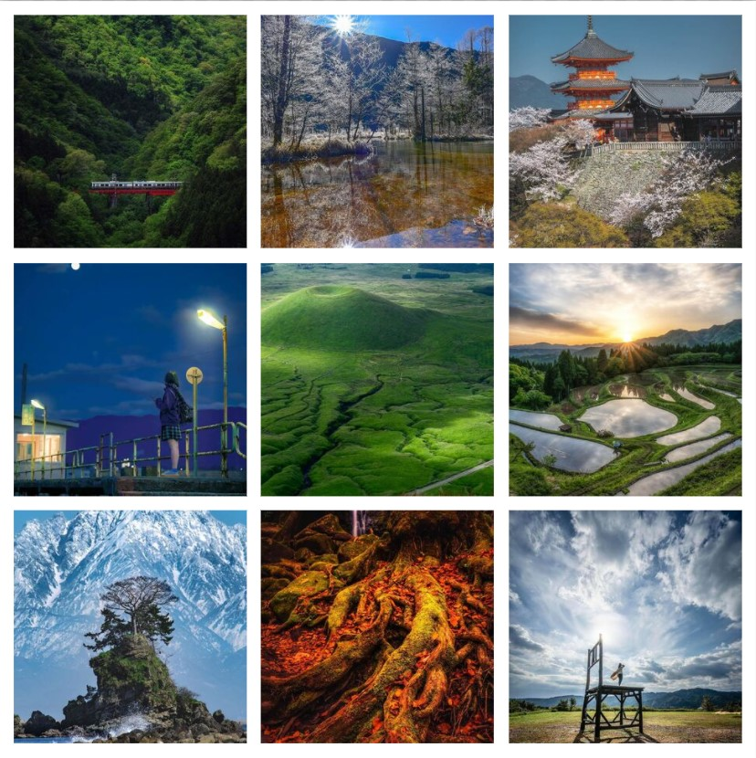

# Miyazaki Style landcape generation using GANs

This repository is an experimental repository for translating real world Japanese landscapes to Miyazaki style animation.

You can find the detailed explanation of the entire procedure in the notebook
- [Miyazaki Cycle-GANs](Miyazaki_CycleGAN.ipynb)

I use a script using selenium for scraping data off [Raw Japan](https://www.instagram.com/raw_japan_/?hl=en), an Instagram handle where you can find exquisite landscapes and scenes which profoundly reflect the genuine beauty of Japan.
The scraper can be found here:
- [Image scraper](data/scrape.py)

(Disclaimer: Instagram actively prohibits image scraping and your account may get suspended for using this scraper. Use at your own risk.)

## Data

This is what the input data looks like (more or less):

#### Distribution A:

#### Distribution B:

We train the GANs in a cyclic fashion and obtain decent results:

More details can be found [here](Miyazaki_CycleGAN.ipynb)
